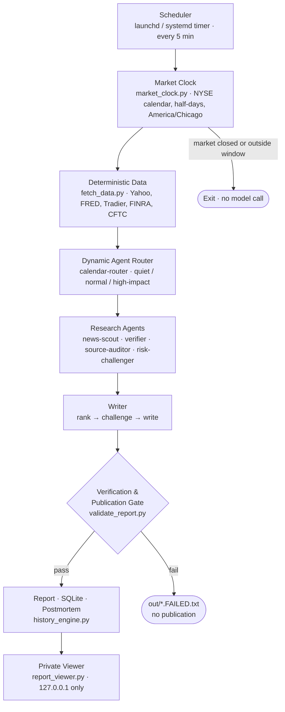

# Market Brief

**An auditable multi-agent workflow for automated US and global cross-asset market briefs.**

*自动化、可审计的美国及全球跨资产市场简报工作流。*

[](https://github.com/HaoyeYang/market-brief/actions/workflows/ci.yml)
[](LICENSE)

> **Not investment advice.** Research and education only. See [Disclaimer](#disclaimer--免责声明).

---

## Overview / 项目简介

**EN** — Market Brief is a scheduled research pipeline, not a streaming market
terminal. On each trading day it collects deterministic cross-asset data, routes
a variable set of research agents against it, verifies every sourced claim
against the fetched page, and only then writes a report. Everything that reaches
the report has passed a publication gate; everything that failed a gate is
recorded rather than quietly dropped.

It runs unattended on macOS via `launchd` or on a Linux server via `systemd`, and
publishes to a private, read-only local viewer. It does not replace exchange data
or human judgement.

**中文** — Market Brief 是一条定时研究流水线，而不是流式行情终端。每个交易日它
先采集确定性的跨资产数据，再按当日情况动态路由研究 agent，对每条带来源的
claim 做抓取核验，最后才写报告。进入报告的内容都通过了 publication gate；未通
过的会被记录，而不是被悄悄丢弃。

它可以在 macOS 上通过 `launchd`、或在 Linux 服务器上通过 `systemd` 无人值守运
行，并输出到一个私有只读的本地 viewer。它不替代交易所行情，也不替代人工判断。

---

## Capabilities / 核心能力

| Capability | 能力 |
|---|---|
| **Pre-open, intraday, and close modes** — pre-open runs 50–5 min before the NYSE open; close runs 15–105 min after a normal or early close; intraday is manual only. | **盘前、盘中、收盘模式** — 盘前在纽约开盘前 50–5 分钟运行；收盘在正常或提前收盘后 15–105 分钟运行；盘中仅供人工触发。 |
| **Market calendar and half-day awareness** — NYSE sessions, holidays, and early closes come from `exchange_calendars`; all time logic resolves in `America/Chicago`. No model is called on a closed day. | **市场日历与半日市识别** — NYSE 交易日、节假日与提前收盘来自 `exchange_calendars`；所有时间判断在 `America/Chicago` 完成，休市日不调用模型。 |
| **Dynamic agent routing** — a router checks official macro, central-bank and major-earnings calendars, then selects 6 agents on a quiet day, 9 on a normal day, and adds dedicated agents on CPI/FOMC, payrolls, central-bank and large-cap-tech days, up to a cap. | **动态 Agent 路由** — 路由器查询官方宏观、央行与大型财报日历，安静日选 6 个角度，普通日 9 个，CPI/FOMC、就业、央行与大型科技财报日再增加专门 agent，总数设上限。 |
| **Multi-provider model routing with fallback** — Claude Code subscription, Anthropic API, NVIDIA-hosted GLM, Z.AI GLM, and Moonshot Kimi, with documented transient-vs-auth retry semantics. | **多模型 Provider 路由与回退** — 支持 Claude Code 订阅、Anthropic API、NVIDIA GLM、Z.AI GLM 与 Moonshot Kimi，并区分瞬态故障与认证错误的重试语义。 |
| **Publication gate** — freshness, dating, source identity, excerpt presence, and claim support are all checked before a report is published atomically. | **Publication gate** — 新鲜度、日期、来源身份、摘录存在性与 claim 支持度全部通过后，才原子发布报告。 |
| **SQLite history/change engine** — day-over-day, 5-day, and 20-day changes computed per mode, so pre-open and close never mix into one comparison series. | **SQLite 历史变化引擎** — 按模式计算昨日/5 日/20 日变化，盘前与收盘不会混入同一比较序列。 |
| **1-day and 5-day postmortem scoring** — catalysts are stored with their original falsifiable conditions and scored when they come due. | **1 日 / 5 日事后评分** — 催化剂连同原始可证伪条件入库，到期后自动评分。 |
| **Options activity proxy** — 0–2DTE and 7–35DTE volume, OI, ATM IV, skew, straddle-implied move, and OI walls for SPY/QQQ/IWM/SMH. | **期权活动代理** — SPY/QQQ/IWM/SMH 的 0–2DTE 与 7–35DTE 成交量、OI、ATM IV、偏度、跨式隐含波幅与 OI 墙。 |
| **FINRA / CFTC positioning proxy** — daily reported short-volume activity and weekly asset-manager / leveraged-fund net positioning, each labelled with its real meaning. | **FINRA / CFTC 仓位代理** — 日频报告短成交活动与周频资产管理/杠杆基金净持仓，并明确标注其真实含义。 |
| **Private read-only viewer** — a no-JavaScript HTML viewer bound to `127.0.0.1` that escapes report text and loads no external asset. | **私有只读可视化报告页面** — 无 JavaScript 的 HTML viewer，绑定 `127.0.0.1`，对报告文本做转义，不加载任何外部资源。 |
| **launchd and systemd deployment** — unit files, a five-minute zero-cost calendar gate, SQLite backup timer, and optional Telegram delivery. | **launchd 与 systemd 部署** — 提供 unit 文件、每 5 分钟零成本日历 gate、SQLite 备份 timer 与可选 Telegram 推送。 |

---

## Architecture / 架构



**EN** — The five-minute scheduler tick is free: it only runs the local
NYSE-aware gate. A model is called only when a report is genuinely due and no
success or failure artifact exists yet for that day and mode. If the machine is
off for the whole window, the report is simply missed — the system will not
generate a report with a misleading timestamp afterwards.

**中文** — 每 5 分钟的调度只运行本地日历 gate，零成本。只有当报告确实到期、且当
天同模式尚无成功/失败产物时才会调用模型。如果整个窗口内机器关机，本次报告就是
错过——系统不会在窗口结束后补出一份时间含义错误的报告。

---

## Quick start / 快速开始

**Requirements:** Python 3.11+, `jq`, outbound HTTPS. Linux service deployments
additionally want 4 GB RAM and persistent storage.

```bash
git clone https://github.com/HaoyeYang/market-brief.git
cd market-brief

# 1. Virtual environment / 创建虚拟环境
python3 -m venv .venv
.venv/bin/pip install --upgrade pip
.venv/bin/pip install -r requirements.txt

# 2. Configure credentials OUTSIDE the repo / 在仓库之外配置凭据
mkdir -p ~/.config/market-brief && chmod 700 ~/.config/market-brief
cp .env.example ~/.config/market-brief/credentials.env
chmod 600 ~/.config/market-brief/credentials.env
# edit that file and replace every `replace_me`

# 3. Zero-cost calendar check / 零成本日历检查（不调用模型）
.venv/bin/python market_clock.py --date "$(TZ=America/Chicago date +%F)" --mode preopen

# 4. Run tests / 运行测试
.venv/bin/python -m unittest discover -s tests -v

# 5. Manual run inside the correct window / 在正确窗口内手动运行
./run.sh preopen        # Claude Code backend
./run_portable.sh close # portable GLM + Kimi backend

# 6. Explore the viewer with a synthetic fixture / 用合成样例查看 viewer
.venv/bin/python scripts/generate_demo.py
.venv/bin/python report_viewer.py --out-dir out --bind 127.0.0.1 --port 8080
# open http://127.0.0.1:8080
```

**EN** — Steps 5 calls a real model and costs real money. `MARKET_BRIEF_FORCE=1`
deliberately overrides the window gate for acceptance testing; use it knowingly.
Step 6 costs nothing and calls no model — `scripts/generate_demo.py` writes an
entirely invented fixture dated `2099-01-02` and stamped SYNTHETIC.

**中文** — 第 5 步会真实调用模型并产生费用。`MARKET_BRIEF_FORCE=1` 可以有意绕过
窗口 gate 做验收，请在知情前提下使用。第 6 步不调用模型也不产生费用：
`scripts/generate_demo.py` 生成的是日期为 `2099-01-02`、标记为 SYNTHETIC 的完全
虚构样例。

### macOS scheduling / macOS 定时

```bash
./scripts/install_launchd.sh
launchctl print "gui/$(id -u)/com.example.market-brief"
```

The installer renders `launchd/com.example.market-brief.plist.template` against
your own `$HOME` and project directory at install time. No absolute personal path
is stored in this repository, and rendered plists are gitignored.

安装脚本在安装时用你自己的 `$HOME` 与项目目录渲染模板。仓库中不保存任何个人绝对
路径，渲染后的 plist 已被 gitignore。

### Linux server / Linux 服务器

See [`deploy/server/README.md`](deploy/server/README.md) for systemd units,
backups, and the tunnelled viewer, and [`deploy/gcp/README.md`](deploy/gcp/README.md)
for Google Cloud sizing notes.

---

## Provider configuration / Provider 配置

**EN** — Variable *names* are documented here and are not secret. Never place a
real key value in this repository, in a systemd unit, or in a launchd plist. Keys
belong in the process environment, in `~/.config/market-brief/credentials.env`
(mode `600`), or in root-owned `/etc/market-brief.env` (mode `600`). Scripts parse
that file against a key-name allowlist instead of `source`-ing it, and refuse
group- or world-readable files.

**中文** — 这里只记录变量名，变量名不是秘密。绝不要把真实 Key 值放进本仓库、
systemd unit 或 launchd plist。密钥应放在进程环境、`~/.config/market-brief/credentials.env`
（权限 `600`）或由 root 拥有的 `/etc/market-brief.env`（权限 `600`）。脚本按键名
白名单解析该文件，不会 `source` 它，并拒绝 group/other 可读的文件。

| Provider | Variables | Notes / 说明 |
|---|---|---|
| **Claude Code subscription** | *(none)* | Uses the interactive Claude Code login and its own credential store. Do not set `ANTHROPIC_API_KEY` unless you intend to change the auth and billing route. 使用 Claude Code 交互登录及其自有凭据存储；除非有意切换认证与计费方式，否则不要设置 `ANTHROPIC_API_KEY`。 |
| **Anthropic API** | `ANTHROPIC_API_KEY` | Unattended alternative for Linux. Also supports `CLAUDE_CODE_USE_BEDROCK` / `CLAUDE_CODE_USE_VERTEX`. Linux 无人值守方案；也支持 Bedrock / Vertex。 |
| **NVIDIA GLM** | `NVIDIA_API_KEY` | Optional. Tried first for GLM research. Transient failures (408/409/425/429, 5xx, timeout, invalid output) retry up to 5 times; auth/request errors (400/401/403/404/422) fall through immediately. 可选，GLM 研究阶段优先尝试；瞬态故障最多重试 5 次，认证/请求错误立即回退。 |
| **Z.AI GLM** | `ZAI_API_KEY`, optional `ZAI_BASE_URL` | Paid fallback (or the direct path when NVIDIA is unset). Global default endpoint is `https://api.z.ai/api/paas/v4`; set `ZAI_BASE_URL` to the China platform endpoint if the key came from there. 付费回退路径；国内平台密钥需另设 `ZAI_BASE_URL`。 |
| **Moonshot / Kimi** | `MOONSHOT_API_KEY` | Second-stage writer in the portable chain. 可移植链路中的第二阶段写作模型。 |
| **Market data (optional)** | `TRADIER_TOKEN`, `TRADIER_BASE_URL`, `FRED_API_KEY` | Tradier upgrades options chains and greeks; without it Yahoo is a best-effort fallback. `FRED_API_KEY` only adds release-timestamp metadata. Tradier 用于升级期权链与希腊字母；未设置时回退到 Yahoo。 |
| **Delivery (optional)** | `TELEGRAM_BOT_TOKEN`, `TELEGRAM_CHAT_ID` | Without them Linux writes status to the journal and macOS uses Notification Center. 未设置时 Linux 写入 journal，macOS 使用通知中心。 |

See [`.env.example`](.env.example) for the full template.

---

## Data sources and limits / 数据源与限制

**EN** — Read this section before trusting any number the system produces. Full
source tiering is in [`docs/DATA_SOURCES.md`](docs/DATA_SOURCES.md).

**中文** — 在信任系统输出的任何数字之前，请先读本节。完整来源分级见
[`docs/DATA_SOURCES.md`](docs/DATA_SOURCES.md)。

- **Yahoo / `yfinance` is best-effort with no SLA.** It is an undocumented,
  unstable, rate-limited endpoint. It can return stale, adjusted, or missing
  values without warning. Do not build anything latency- or accuracy-critical on
  it. *Yahoo/yfinance 是 best effort、无 SLA 的非官方接口，可能返回过期、调整后
  或缺失的数据。*
- **FRED** provides official US macro and Treasury series, but each series has
  its own release lag and revision schedule. A "latest value" is a *released*
  value, not a nowcast. *FRED 是官方数据，但每个序列有各自的发布滞后与修订；
  「最新值」是已发布值，不是即时预测。*
- **FINRA short volume** covers short *sale volume* on reporting facilities only.
  It is **not** net fund flow, not net short interest, and not a measure of money
  entering or leaving an ETF. The system will not describe it as such. *FINRA
  short volume 只是报告设施上的卖空成交量，**不是**资金净流入、不是净空头持仓。*
- **CFTC Commitments of Traders** is weekly futures positioning published with a
  lag. It is not a real-time flow signal. *CFTC 是周频期货持仓且有发布滞后，不是
  实时资金流信号。*
- **Options volume cannot identify trade direction.** Free chains expose no
  aggressor side and no dealer inventory. *期权成交量无法判断买卖方向，免费链
  不提供主动方或做市商库存。*
- **Open interest is not real-time.** It reflects the prior clearing cycle.
  *Open Interest 是上一清算周期的数据，不是实时值。*
- **No dealer gamma exposure (GEX) is inferred.** Deriving dealer GEX requires
  dealer positioning data this project does not have, so the system deliberately
  produces no GEX conclusion. *本项目不从现有数据推断 dealer GEX，因为缺少必要的
  做市商仓位数据。*

When a direction field cannot be verified, the pipeline redacts it and the
viewer renders "direction not assessed" rather than coloring it as a market
conclusion. 当方向字段无法核验时，流水线会将其屏蔽，viewer 显示「方向未评估」，
而不是着色成行情结论。

---

## Security model / 安全模型

**EN**

- **Credentials never enter Git.** `.gitignore` blocks `.env`, `credentials.*`,
  `*.pem`, `*.key`, `*.p12`, service-account JSON, and rendered plists. Keys live
  in the process environment or in a mode-`600` file outside the repository.
- **The viewer binds `127.0.0.1` by default.** It has no authentication and must
  never be bound to a public interface or exposed through a firewall rule.
- **Reach a remote viewer through Google Cloud IAP TCP forwarding or an SSH
  tunnel**, not by opening a port. `deploy/server/README.md` has the exact command.
- **Raw artifacts stay private.** `out/`, `data/`, `logs/`, `state/`, and
  `backups/` hold raw model output and market snapshots; they are gitignored and
  must not be served to the public internet.
- **The viewer is defensive by construction:** no JavaScript, no external CDN,
  `Content-Security-Policy: default-src 'none'`, report text HTML-escaped rather
  than rendered, and path traversal rejected.
- `deploy/gcp/sync_credentials.sh` prints key **names** only, requires local mode
  `600`, uploads through IAP, installs root-owned, and cleans up on any exit path.

See [`SECURITY.md`](SECURITY.md) for reporting and rotation guidance.

**中文**

- **凭据绝不进入 Git**：`.gitignore` 屏蔽 `.env`、`credentials.*`、`*.pem`、
  `*.key`、`*.p12`、service-account JSON 与渲染后的 plist；密钥只存在于进程环境或
  仓库之外权限 `600` 的文件中。
- **viewer 默认绑定 `127.0.0.1`**：它没有认证，绝不能绑定公网接口或通过防火墙暴露。
- **远程访问请使用 Google Cloud IAP TCP 转发或 SSH 隧道**，不要开放端口。
- **原始产物保持私有**：`out/`、`data/`、`logs/`、`state/`、`backups/` 含原始模型
  输出与市场快照，已被 gitignore，不得对公网提供服务。
- **viewer 在构造上是防御性的**：无 JavaScript、无外部 CDN、
  `Content-Security-Policy: default-src 'none'`、报告文本转义而非渲染、拒绝路径穿越。
- `deploy/gcp/sync_credentials.sh` 只打印键名，要求本地权限 `600`，经 IAP 上传，
  安装为 root 所有，并在任何退出路径上清理临时文件。

---

## Repository layout / 目录结构

```text
market_clock.py            NYSE calendar, half-days, America/Chicago window logic
fetch_data.py              Deterministic cross-asset data collection
derivatives_positioning.py Options, FINRA, and CFTC proxies
history_engine.py          SQLite snapshots, 1/5/20-day changes, postmortem scoring
validate_report.py         Publication gate
multi_provider_brief.py    Portable GLM + Kimi provider chain
report_viewer.py           Private read-only HTTP viewer (127.0.0.1)
recover_workflow.py        Strict recovery from a completed workflow journal
backup_sqlite.py           Online SQLite backup with integrity check
run.sh / run_portable.sh   Locking, gates, atomic publish, notification
schedule.sh                Free five-minute calendar gate
.claude/agents/            Research agent definitions
.claude/workflows/         Workflow orchestration
deploy/                    systemd units, server and GCP deployment docs
launchd/                   macOS plist template (placeholders only)
scripts/generate_demo.py   Synthetic demo fixture generator
docs/                      Data source tiering and workflow design
tests/                     Offline unit tests, no network calls
```

---

## Testing / 测试

```bash
.venv/bin/python -m compileall -q .
.venv/bin/python -m unittest discover -s tests -v
bash -n run.sh run_portable.sh schedule.sh scripts/install_launchd.sh \
       deploy/server/install_systemd.sh deploy/gcp/sync_credentials.sh
```

The suite is fully offline: it calls no model API and no market API. CI runs it
on Python 3.11 and 3.12, requires no GitHub Actions secret, and uses
`contents: read` permissions only.

测试套件完全离线，不调用任何模型或行情 API。CI 在 Python 3.11 与 3.12 上运行，
不需要任何 GitHub Actions Secret，权限仅为 `contents: read`。

---

## Disclaimer / 免责声明

**EN**

This project is provided for **research and educational purposes only**.

- It does **not** constitute investment advice, a recommendation, a solicitation,
  or an offer to buy or sell any security or financial instrument.
- Its data may be **delayed, incomplete, adjusted, or wrong**. Several sources
  are unofficial, best-effort endpoints with no SLA.
- Model-generated text can be confidently incorrect even after passing every gate
  in this repository. The gates reduce error rates; they do not eliminate them.
- **You must independently verify every number and claim** before acting on it.
- The authors and contributors accept no liability for any loss arising from use
  of this software. See [`LICENSE`](LICENSE).

**中文**

本项目**仅用于研究与教育目的**。

- 它**不构成**投资建议、推荐、要约或买卖任何证券及金融工具的邀请。
- 其数据可能**延迟、不完整、经过调整或错误**；部分来源是无 SLA 的非官方接口。
- 即使通过了本仓库中的全部 gate，模型生成的文本仍可能自信地出错。Gate 降低错误
  率，但不能消除错误。
- **使用者必须自行独立验证每一个数字与结论**后再采取任何行动。
- 作者与贡献者不对因使用本软件造成的任何损失承担责任，详见 [`LICENSE`](LICENSE)。

---

## License / 许可证

[MIT](LICENSE)
