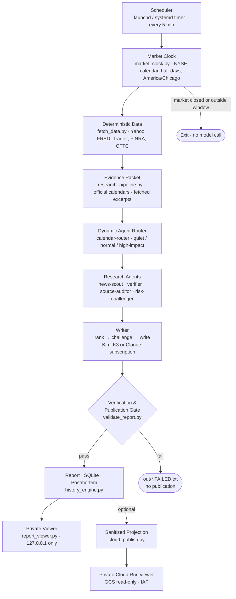

<div align="center">

# Market Brief

**English** · [简体中文](README.zh-CN.md)

**An auditable multi-agent workflow for automated US and global cross-asset market briefs.**

[](https://github.com/HaoyeYang/market-brief/actions/workflows/ci.yml)
[](LICENSE)
[](https://www.python.org/)

</div>

> **Not investment advice.** Research and education only. See the [Disclaimer](#disclaimer).

---

## Overview

Market Brief is a scheduled research pipeline, not a streaming market terminal.
On each trading day it collects deterministic cross-asset data, routes a variable
set of research agents against it, verifies every sourced claim against the
fetched page, and only then writes a report. Everything that reaches the report
has passed a publication gate; everything that failed a gate is recorded rather
than quietly dropped.

It runs unattended on macOS via `launchd` or on a Linux server via `systemd`, and
publishes to a private, read-only local viewer. It does not replace exchange data
or human judgement.

---

## Capabilities

- **Pre-open, intraday, and close modes.** Pre-open runs 50–5 minutes before the
  NYSE open; close runs 15–105 minutes after a normal or early close; intraday is
  manual only.
- **Market calendar and half-day awareness.** NYSE sessions, holidays, and early
  closes come from `exchange_calendars`; all time logic resolves in
  `America/Chicago`. No model is called on a closed day.
- **Dynamic agent routing.** A router checks official macro, central-bank, and
  major-earnings calendars, then selects 6 agents on a quiet day and 9 on a normal
  day, adding dedicated agents on CPI/FOMC, payrolls, central-bank, and
  large-cap-tech days, up to a cap.
- **Evidence-first research packet.** `research_pipeline.py` builds a bounded,
  auditable evidence set before any research agent runs. Official calendars and
  releases (BLS, BEA, Federal Reserve, Treasury, SEC, CFTC, CME) are first-class
  evidence; GDELT is used only to *discover* candidate articles. An item becomes
  publishable evidence only after its source page is actually fetched and a usable
  excerpt is extracted, so an unreachable headline never becomes a citation.
- **Provider-neutral specialist agents.** The portable chain runs four scoped
  research agents — US equities, macro and rates, the AI/semiconductor chain, and
  global cross-asset — followed by a source verifier, without depending on Claude
  Code.
- **Multi-provider model routing with fallback.** Claude Code subscription,
  Anthropic API, NVIDIA-hosted GLM, Z.AI GLM, and Moonshot Kimi, with documented
  transient-versus-auth retry semantics.
- **Hybrid writer route.** `MARKET_BRIEF_WRITER=claude` keeps the free/cheap GLM
  research tier and swaps only the writer for the Claude Code CLI on a
  subscription login. Kimi remains the automatic fallback when OAuth expires,
  quota runs out, or the Claude payload fails validation, and the writer strips
  `ANTHROPIC_API_KEY`/`ANTHROPIC_AUTH_TOKEN` first so a subscription run cannot
  silently become a metered API charge.
- **Publication gate.** Freshness, dating, source identity, excerpt presence, and
  claim support are all checked before a report is published atomically.
- **SQLite history and change engine.** Day-over-day, 5-day, and 20-day changes
  are computed per mode, so pre-open and close never mix into one comparison
  series.
- **1-day and 5-day postmortem scoring.** Catalysts are stored with their original
  falsifiable conditions and scored when they come due.
- **Options activity proxy.** 0–2DTE and 7–35DTE volume, open interest, ATM IV,
  skew, straddle-implied move, and OI walls for SPY, QQQ, IWM, and SMH.
- **FINRA and CFTC positioning proxy.** Daily reported short-volume activity and
  weekly asset-manager / leveraged-fund net positioning, each labelled with its
  real meaning.
- **Private read-only viewer, now tabbed.** A no-JavaScript HTML viewer bound to
  `127.0.0.1` that escapes report text and loads no external asset, split into
  market overview, news and catalysts, macro calendar and central banks, options
  and flow activity, and historical change plus agent scoring.
- **Optional private mobile access.** `cloud_publish.py` uploads a deliberately
  small, allowlisted, sanitized projection of a finished report to a private
  Cloud Storage bucket, which a Cloud Run service mounts read-only behind IAP.
  Raw market data, prompts, model traces, logs, SQLite, and credentials are never
  uploaded, and the payload is scanned for secret markers before it leaves the
  host.
- **Verifier repair without a rerun.** `repair_verification.py` rebuilds a
  malformed verifier packet from existing artifacts instead of re-invoking the
  specialists and writer, so one bad JSON response does not cost a full run.
- **launchd and systemd deployment.** Unit files, a five-minute zero-cost calendar
  gate, a SQLite backup timer, and optional Telegram or Gmail delivery.

---

## Architecture



The five-minute scheduler tick is free: it only runs the local NYSE-aware gate. A
model is called only when a report is genuinely due and no success or failure
artifact exists yet for that day and mode. If the machine is off for the whole
window, the report is simply missed — the system will not generate a report with
a misleading timestamp afterwards.

---

## Quick start

**Requirements:** Python 3.11+, `jq`, and outbound HTTPS. Linux service
deployments additionally want 4 GB RAM and persistent storage.

```bash
git clone https://github.com/HaoyeYang/market-brief.git
cd market-brief

# 1. Virtual environment
python3 -m venv .venv
.venv/bin/pip install --upgrade pip
.venv/bin/pip install -r requirements.txt

# 2. Configure credentials OUTSIDE the repository
mkdir -p ~/.config/market-brief && chmod 700 ~/.config/market-brief
cp .env.example ~/.config/market-brief/credentials.env
chmod 600 ~/.config/market-brief/credentials.env
# edit that file and replace every `replace_me`

# 3. Zero-cost calendar check (calls no model)
.venv/bin/python market_clock.py --date "$(TZ=America/Chicago date +%F)" --mode preopen

# 4. Run tests
.venv/bin/python -m unittest discover -s tests -v

# 5. Manual run inside the correct window
./run.sh preopen        # Claude Code backend
./run_portable.sh close # portable GLM + Kimi backend

# 6. Explore the viewer with a synthetic fixture
.venv/bin/python scripts/generate_demo.py
.venv/bin/python report_viewer.py --out-dir out --bind 127.0.0.1 --port 8080
# open http://127.0.0.1:8080
```

Step 5 calls a real model and costs real money. `MARKET_BRIEF_FORCE=1`
deliberately overrides the window gate for acceptance testing; use it knowingly.

Step 6 costs nothing and calls no model. `scripts/generate_demo.py` writes an
entirely invented fixture dated `2099-01-02` and stamped SYNTHETIC, so the viewer
can be explored without any real market data.

### macOS scheduling

```bash
./scripts/install_launchd.sh
launchctl print "gui/$(id -u)/com.example.market-brief"
```

The installer renders `launchd/com.example.market-brief.plist.template` against
your own `$HOME` and project directory at install time. No absolute personal path
is stored in this repository, and rendered plists are gitignored.

### Linux server

See [`deploy/server/README.md`](deploy/server/README.md) for systemd units,
backups, the tunnelled viewer, and the optional Claude subscription writer;
[`deploy/gcp/README.md`](deploy/gcp/README.md) for Google Cloud sizing and
credential rotation; and [`deploy/cloudrun/README.md`](deploy/cloudrun/README.md)
for the optional private mobile viewer behind IAP.

---

## Provider configuration

Variable *names* are documented here and are not secret. Never place a real key
value in this repository, in a systemd unit, or in a launchd plist. Keys belong
in the process environment, in `~/.config/market-brief/credentials.env` (mode
`600`), or in root-owned `/etc/market-brief.env` (mode `600`). Scripts parse that
file against a key-name allowlist instead of `source`-ing it, and refuse group- or
world-readable files.

| Provider | Variables | Notes |
|---|---|---|
| **Claude Code subscription** | *(none)* | Uses the interactive Claude Code login and its own credential store. Do not set `ANTHROPIC_API_KEY` unless you intend to change the auth and billing route. |
| **Anthropic API** | `ANTHROPIC_API_KEY` | Unattended alternative for Linux. Also supports `CLAUDE_CODE_USE_BEDROCK` and `CLAUDE_CODE_USE_VERTEX`. |
| **NVIDIA GLM** | `NVIDIA_API_KEY` | Optional, tried first for GLM research. Transient failures (408/409/425/429, 5xx, timeout, invalid output) retry up to 5 times; auth and request errors (400/401/403/404/422) fall through immediately, because repeating a bad key cannot recover. |
| **Z.AI GLM** | `ZAI_API_KEY`, optional `ZAI_BASE_URL` | Paid fallback, or the direct path when NVIDIA is unset. The global default endpoint is `https://api.z.ai/api/paas/v4`; set `ZAI_BASE_URL` to the China platform endpoint if the key came from there. |
| **Moonshot / Kimi** | `MOONSHOT_API_KEY` | Second-stage writer in the portable chain. |
| **Market data** (optional) | `TRADIER_TOKEN`, `TRADIER_BASE_URL`, `FRED_API_KEY` | Tradier upgrades options chains and greeks; without it Yahoo is a best-effort fallback. `FRED_API_KEY` only adds release-timestamp metadata. |
| **Writer route** (optional) | `MARKET_BRIEF_WRITER`, `MARKET_BRIEF_CLAUDE_MODEL`, `MARKET_BRIEF_CLAUDE_EFFORT`, `CLAUDE_BIN` | Defaults to `kimi`. Set `MARKET_BRIEF_WRITER=claude` to use the Claude Code CLI as the writer while keeping GLM research agents; Kimi stays as the automatic fallback, so keep `MOONSHOT_API_KEY` configured. |
| **Research etiquette** (optional) | `MARKET_BRIEF_CONTACT` | An identifiable operator email sent as the crawler contact, as BLS and SEC fair-access policies request. Defaults to a placeholder; set a real address before running the pipeline at any volume. |
| **Private mobile viewer** (optional) | `GCP_PROJECT_ID`, `MARKET_BRIEF_GCS_BUCKET`, `MARKET_BRIEF_WEB_URL` | Enables the sanitized Cloud Storage upload after a successful run. Unset means no upload happens at all. |
| **Delivery** (optional) | `TELEGRAM_BOT_TOKEN`, `TELEGRAM_CHAT_ID`, `GMAIL_SMTP_USER`, `GMAIL_APP_PASSWORD`, `MARKET_BRIEF_EMAIL_TO` | Without them Linux writes status to the systemd journal and macOS uses Notification Center. Gmail delivery requires a Google App Password, never the account password. |

See [`.env.example`](.env.example) for the full template.

Provider keys and operator configuration are kept in two separate root-owned
files on a Linux deployment — `/etc/market-brief.credentials.env` for keys and
`/etc/market-brief.env` for everything else — so that rotating a key never
overwrites configuration. The systemd unit loads both. Do not `source` either
file in a shell: they are parsed as dotenv / systemd `EnvironmentFile` data, and
an unquoted App Password containing spaces is not shell-safe.

---

## Data sources and limits

Read this section before trusting any number the system produces. Full source
tiering is in [`docs/DATA_SOURCES.md`](docs/DATA_SOURCES.md).

- **Yahoo / `yfinance` is best-effort with no SLA.** It is an undocumented,
  unstable, rate-limited endpoint. It can return stale, adjusted, or missing
  values without warning. Do not build anything latency- or accuracy-critical on
  it.
- **FRED** provides official US macro and Treasury series, but each series has its
  own release lag and revision schedule. A "latest value" is a *released* value,
  not a nowcast.
- **FINRA short volume** covers short *sale volume* on reporting facilities only.
  It is **not** net fund flow, not net short interest, and not a measure of money
  entering or leaving an ETF. The system will not describe it as such.
- **CFTC Commitments of Traders** is weekly futures positioning published with a
  lag. It is not a real-time flow signal.
- **Options volume cannot identify trade direction.** Free chains expose no
  aggressor side and no dealer inventory.
- **Open interest is not real-time.** It reflects the prior clearing cycle.
- **No dealer gamma exposure (GEX) is inferred.** Deriving dealer GEX requires
  dealer positioning data this project does not have, so the system deliberately
  produces no GEX conclusion.

When a direction field cannot be verified, the pipeline redacts it and the viewer
renders "direction not assessed" rather than coloring it as a market conclusion.

---

## Security model

- **Credentials never enter Git.** `.gitignore` blocks `.env`, `credentials.*`,
  `*.pem`, `*.key`, `*.p12`, service-account JSON, and rendered plists. Keys live
  in the process environment or in a mode-`600` file outside the repository.
- **The viewer binds `127.0.0.1` by default.** It has no authentication and must
  never be bound to a public interface or exposed through a firewall rule.
- **Reach a remote viewer through Google Cloud IAP TCP forwarding or an SSH
  tunnel**, not by opening a port. `deploy/server/README.md` has the exact command.
- **Raw artifacts stay private.** `out/`, `data/`, `logs/`, `state/`, and
  `backups/` hold raw model output and market snapshots; they are gitignored and
  must not be served to the public internet.
- **The viewer is defensive by construction:** no JavaScript, no external CDN,
  `Content-Security-Policy: default-src 'none'`, report text HTML-escaped rather
  than rendered, and path traversal rejected.
- `deploy/gcp/sync_credentials.sh` prints key **names** only, requires local mode
  `600`, uploads through IAP, installs the file root-owned, and cleans up local
  and remote temporary files on any exit path.
- **Cloud publication is allowlist-based, not filter-based.** `cloud_publish.py`
  uploads only report Markdown, sanitized deterministic data, ranked catalysts,
  audited evidence, historical comparisons, agent and source scores, and
  aggregate usage. It drops known-sensitive keys, refuses payloads containing
  secret markers or host paths, and never uploads raw data, prompts, model
  traces, logs, SQLite, request IDs, or failure files. A `--dry-run` mode shows
  exactly what would be published.
- **The Cloud Run viewer must stay private.** Do not grant `allUsers` either the
  Run Invoker or the IAP accessor role; the bucket is mounted read-only.

See [`SECURITY.md`](SECURITY.md) for reporting and rotation guidance.

---

## Repository layout

```text
market_clock.py            NYSE calendar, half-days, America/Chicago window logic
fetch_data.py              Deterministic cross-asset data collection
derivatives_positioning.py Options, FINRA, and CFTC proxies
history_engine.py          SQLite snapshots, 1/5/20-day changes, postmortem scoring
research_pipeline.py       Official calendars + fetched-source evidence packet
validate_report.py         Publication gate
multi_provider_brief.py    Portable GLM + Kimi/Claude provider chain
repair_verification.py     Rebuild a malformed verifier packet without a rerun
cloud_publish.py           Sanitized allowlist upload to a private GCS bucket
report_viewer.py           Private read-only tabbed HTTP viewer (127.0.0.1)
recover_workflow.py        Strict recovery from a completed workflow journal
backup_sqlite.py           Online SQLite backup with integrity check
notify.py                  Gmail / Telegram / macOS completion notification
run.sh / run_portable.sh   Locking, gates, atomic publish, notification
schedule.sh                Free five-minute calendar gate
.claude/agents/            Research agent definitions
.claude/workflows/         Workflow orchestration
deploy/                    systemd units, server, GCP, and Cloud Run docs
launchd/                   macOS plist template (placeholders only)
scripts/generate_demo.py   Synthetic demo fixture generator
docs/                      Data source tiering and workflow design
tests/                     Offline unit tests, no network calls
```

---

## Testing

```bash
.venv/bin/python -m compileall -q .
.venv/bin/python -m unittest discover -s tests -v
bash -n run.sh run_portable.sh schedule.sh scripts/install_launchd.sh \
       deploy/server/install_systemd.sh deploy/gcp/sync_credentials.sh
```

The suite is fully offline: it calls no model API and no market API. CI runs it on
Python 3.11 and 3.12, requires no GitHub Actions secret, and uses `contents: read`
permissions only.

---

## Disclaimer

This project is provided for **research and educational purposes only**.

- It does **not** constitute investment advice, a recommendation, a solicitation,
  or an offer to buy or sell any security or financial instrument.
- Its data may be **delayed, incomplete, adjusted, or wrong**. Several sources are
  unofficial, best-effort endpoints with no SLA.
- Model-generated text can be confidently incorrect even after passing every gate
  in this repository. The gates reduce error rates; they do not eliminate them.
- **You must independently verify every number and claim** before acting on it.
- The authors and contributors accept no liability for any loss arising from use
  of this software. See [`LICENSE`](LICENSE).

---

## License

[MIT](LICENSE)
