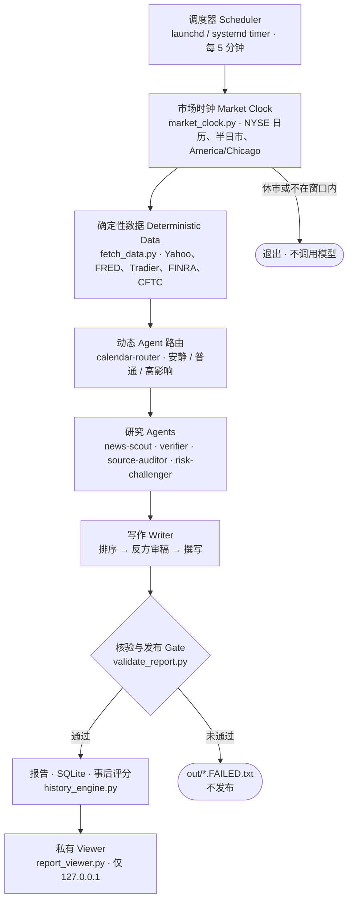

<div align="center">

# Market Brief

[English](README.md) · **简体中文**

**自动化、可审计的美国及全球跨资产市场简报工作流。**

[](https://github.com/HaoyeYang/market-brief/actions/workflows/ci.yml)
[](LICENSE)
[](https://www.python.org/)

</div>

> **不构成投资建议。** 仅用于研究与教育。请阅读[免责声明](#免责声明)。

---

## 项目简介

Market Brief 是一条定时研究流水线，而不是流式行情终端。每个交易日它先采集确定性
的跨资产数据，再按当日情况动态路由研究 agent，对每条带来源的 claim 做抓取核验，
最后才写报告。进入报告的内容都通过了 publication gate；未通过的会被记录，而不是
被悄悄丢弃。

它可以在 macOS 上通过 `launchd`、或在 Linux 服务器上通过 `systemd` 无人值守运行，
并输出到一个私有只读的本地 viewer。它不替代交易所行情，也不替代人工判断。

---

## 核心能力

- **盘前、盘中、收盘模式。** 盘前在纽约开盘前 50–5 分钟运行；收盘在正常或提前收盘
  后 15–105 分钟运行；盘中仅供人工触发。
- **市场日历与半日市识别。** NYSE 交易日、节假日与提前收盘来自 `exchange_calendars`；
  所有时间判断在 `America/Chicago` 完成，休市日不调用模型。
- **动态 Agent 路由。** 路由器查询官方宏观、央行与大型财报日历，安静日选 6 个研究
  角度，普通日 9 个；CPI/FOMC、就业、央行与大型科技财报日再增加专门 agent，总数
  设有上限。
- **多模型 Provider 路由与回退。** 支持 Claude Code 订阅、Anthropic API、NVIDIA GLM、
  Z.AI GLM 与 Moonshot Kimi，并明确区分瞬态故障与认证错误的重试语义。
- **Publication gate。** 新鲜度、日期、来源身份、摘录存在性与 claim 支持度全部通过
  后，才原子发布报告。
- **SQLite 历史变化引擎。** 按模式分别计算昨日、5 日与 20 日变化，盘前与收盘不会
  混入同一比较序列。
- **1 日 / 5 日事后评分。** 催化剂连同其原始可证伪条件一起入库，到期后自动评分。
- **期权活动代理。** SPY、QQQ、IWM、SMH 的 0–2DTE 与 7–35DTE 成交量、未平仓合约、
  ATM 隐含波动率、偏度、跨式隐含波幅与 OI 墙。
- **FINRA / CFTC 仓位代理。** 日频报告短成交活动与周频资产管理、杠杆基金净持仓，
  并各自明确标注其真实含义。
- **私有只读可视化报告页面。** 无 JavaScript 的 HTML viewer，绑定 `127.0.0.1`，对
  报告文本做转义，不加载任何外部资源。
- **launchd 与 systemd 部署。** 提供 unit 文件、每 5 分钟零成本日历 gate、SQLite
  备份 timer 与可选的 Telegram 推送。

---

## 架构



每 5 分钟的调度只运行本地日历 gate，零成本。只有当报告确实到期、且当天同模式尚无
成功或失败产物时，才会调用模型。如果整个窗口内机器关机，本次报告就是错过——系统
不会在窗口结束后补出一份时间含义错误的报告。

---

## 快速开始

**环境要求：** Python 3.11+、`jq`、可访问外网的 HTTPS。Linux 服务器部署还建议 4 GB
内存与持久化存储。

```bash
git clone https://github.com/HaoyeYang/market-brief.git
cd market-brief

# 1. 创建虚拟环境
python3 -m venv .venv
.venv/bin/pip install --upgrade pip
.venv/bin/pip install -r requirements.txt

# 2. 在仓库之外配置凭据
mkdir -p ~/.config/market-brief && chmod 700 ~/.config/market-brief
cp .env.example ~/.config/market-brief/credentials.env
chmod 600 ~/.config/market-brief/credentials.env
# 编辑该文件，替换掉每一个 `replace_me`

# 3. 零成本日历检查（不调用模型）
.venv/bin/python market_clock.py --date "$(TZ=America/Chicago date +%F)" --mode preopen

# 4. 运行测试
.venv/bin/python -m unittest discover -s tests -v

# 5. 在正确窗口内手动运行
./run.sh preopen        # Claude Code 后端
./run_portable.sh close # 可移植的 GLM + Kimi 后端

# 6. 用合成样例查看 viewer
.venv/bin/python scripts/generate_demo.py
.venv/bin/python report_viewer.py --out-dir out --bind 127.0.0.1 --port 8080
# 打开 http://127.0.0.1:8080
```

第 5 步会真实调用模型并产生费用。`MARKET_BRIEF_FORCE=1` 可以有意绕过窗口 gate 做
验收，请在知情的前提下使用。

第 6 步不调用模型，也不产生任何费用。`scripts/generate_demo.py` 生成的是日期为
`2099-01-02`、标记为 SYNTHETIC 的完全虚构样例，因此无需任何真实市场数据即可查看
viewer 效果。

### macOS 定时

```bash
./scripts/install_launchd.sh
launchctl print "gui/$(id -u)/com.example.market-brief"
```

安装脚本会在安装时，用你自己的 `$HOME` 与项目目录渲染
`launchd/com.example.market-brief.plist.template`。仓库中不保存任何个人绝对路径，
渲染后的 plist 已被 gitignore。

### Linux 服务器

systemd unit、备份与隧道 viewer 见 [`deploy/server/README.md`](deploy/server/README.md)；
Google Cloud 机型与免费额度注意事项见 [`deploy/gcp/README.md`](deploy/gcp/README.md)。

---

## Provider 配置

这里只记录变量**名**，变量名本身不是秘密。绝不要把真实 Key 值放进本仓库、systemd
unit 或 launchd plist。密钥应放在进程环境、`~/.config/market-brief/credentials.env`
（权限 `600`）或由 root 拥有的 `/etc/market-brief.env`（权限 `600`）中。脚本按键名
白名单解析该文件，不会 `source` 它，并拒绝 group 或 other 可读的文件。

| Provider | 变量 | 说明 |
|---|---|---|
| **Claude Code 订阅** | *（无）* | 使用 Claude Code 的交互式登录及其自有凭据存储。除非有意切换认证与计费方式，否则不要设置 `ANTHROPIC_API_KEY`。 |
| **Anthropic API** | `ANTHROPIC_API_KEY` | Linux 无人值守方案。也支持 `CLAUDE_CODE_USE_BEDROCK` 与 `CLAUDE_CODE_USE_VERTEX`。 |
| **NVIDIA GLM** | `NVIDIA_API_KEY` | 可选，GLM 研究阶段优先尝试。瞬态故障（408/409/425/429、5xx、超时、无效输出）最多重试 5 次；认证与请求错误（400/401/403/404/422）立即回退，因为重复使用坏密钥没有意义。 |
| **Z.AI GLM** | `ZAI_API_KEY`，可选 `ZAI_BASE_URL` | 付费回退路径；未配置 NVIDIA 时则直接使用。国际版默认端点为 `https://api.z.ai/api/paas/v4`；若密钥来自智谱国内平台，需将 `ZAI_BASE_URL` 设为国内端点。 |
| **Moonshot / Kimi** | `MOONSHOT_API_KEY` | 可移植链路中的第二阶段写作模型。 |
| **行情数据**（可选） | `TRADIER_TOKEN`、`TRADIER_BASE_URL`、`FRED_API_KEY` | Tradier 用于升级期权链与希腊字母；未设置时回退到 best-effort 的 Yahoo。`FRED_API_KEY` 仅增加发布时间元数据。 |
| **推送**（可选） | `TELEGRAM_BOT_TOKEN`、`TELEGRAM_CHAT_ID` | 未设置时，Linux 写入 systemd journal，macOS 使用通知中心。 |

完整模板见 [`.env.example`](.env.example)。

---

## 数据源与限制

在信任系统输出的任何数字之前，请先读本节。完整来源分级见
[`docs/DATA_SOURCES.md`](docs/DATA_SOURCES.md)。

- **Yahoo / `yfinance` 是 best effort、无 SLA 的接口。** 它是未公开文档、不稳定且
  有频率限制的端点，可能在没有任何提示的情况下返回过期、调整后或缺失的数据。请
  不要在其上构建对延迟或准确性有硬要求的系统。
- **FRED** 提供官方美国宏观与美债序列，但每个序列都有各自的发布滞后与修订安排。
  「最新值」是**已发布值**，不是即时预测（nowcast）。
- **FINRA short volume** 只覆盖报告设施上的**卖空成交量**。它**不是**资金净流入、
  不是净空头持仓，也不衡量资金进出某只 ETF。本系统不会这样描述它。
- **CFTC 持仓报告（COT）** 是带发布滞后的周频期货持仓，不是实时资金流信号。
- **期权成交量无法判断买卖方向。** 免费期权链既不提供主动成交方，也不提供做市商
  库存。
- **未平仓合约（OI）不是实时数据**，它反映的是上一个清算周期。
- **不推断做市商 Gamma Exposure（GEX）。** 推导 dealer GEX 需要本项目并不具备的做
  市商仓位数据，因此系统刻意不产生任何 GEX 结论。

当某个方向字段无法核验时，流水线会将其屏蔽，viewer 显示「方向未评估」，而不是把它
着色成一个行情结论。

---

## 安全模型

- **凭据绝不进入 Git。** `.gitignore` 屏蔽 `.env`、`credentials.*`、`*.pem`、
  `*.key`、`*.p12`、service-account JSON 以及渲染后的 plist。密钥只存在于进程环境
  或仓库之外权限为 `600` 的文件中。
- **viewer 默认绑定 `127.0.0.1`。** 它没有任何认证机制，绝不能绑定到公网接口，也
  不能通过防火墙规则对外暴露。
- **远程访问请使用 Google Cloud IAP TCP 转发或 SSH 隧道**，而不是开放端口。具体命令
  见 `deploy/server/README.md`。
- **原始产物保持私有。** `out/`、`data/`、`logs/`、`state/`、`backups/` 含有原始模型
  输出与市场快照；它们已被 gitignore，且不得对公网提供服务。
- **viewer 在构造上就是防御性的：** 无 JavaScript、无外部 CDN、
  `Content-Security-Policy: default-src 'none'`、对报告文本做 HTML 转义而非渲染、
  并拒绝路径穿越。
- `deploy/gcp/sync_credentials.sh` 只打印键**名**，要求本地文件权限为 `600`，经 IAP
  上传，安装为 root 所有，并在任何退出路径上清理本地与远端临时文件。

报告渠道与轮换建议见 [`SECURITY.md`](SECURITY.md)。

---

## 目录结构

```text
market_clock.py            NYSE 日历、半日市、America/Chicago 窗口逻辑
fetch_data.py              确定性跨资产数据采集
derivatives_positioning.py 期权、FINRA 与 CFTC 代理指标
history_engine.py          SQLite 快照、1/5/20 日变化、事后评分
validate_report.py         Publication gate
multi_provider_brief.py    可移植的 GLM + Kimi 供应商链路
report_viewer.py           私有只读 HTTP viewer（127.0.0.1）
recover_workflow.py        从已完成 workflow journal 的严格恢复
backup_sqlite.py           带完整性校验的 SQLite 在线备份
run.sh / run_portable.sh   加锁、gate、原子发布、通知
schedule.sh                零成本的五分钟日历 gate
.claude/agents/            研究 agent 定义
.claude/workflows/         工作流编排
deploy/                    systemd unit、服务器与 GCP 部署文档
launchd/                   macOS plist 模板（仅含占位符）
scripts/generate_demo.py   合成演示样例生成器
docs/                      数据来源分级与工作流设计
tests/                     离线单元测试，不发起网络调用
```

---

## 测试

```bash
.venv/bin/python -m compileall -q .
.venv/bin/python -m unittest discover -s tests -v
bash -n run.sh run_portable.sh schedule.sh scripts/install_launchd.sh \
       deploy/server/install_systemd.sh deploy/gcp/sync_credentials.sh
```

测试套件完全离线：不调用任何模型 API，也不调用任何行情 API。CI 在 Python 3.11 与
3.12 上运行，不需要任何 GitHub Actions Secret，权限仅为 `contents: read`。

---

## 免责声明

本项目**仅用于研究与教育目的**。

- 它**不构成**投资建议、推荐、要约，也不构成买卖任何证券或金融工具的邀请。
- 其数据可能**延迟、不完整、经过调整或错误**；其中若干来源是无 SLA 的非官方接口。
- 即使通过了本仓库中的全部 gate，模型生成的文本仍可能自信地出错。这些 gate 降低
  错误率，但不能消除错误。
- **使用者必须自行独立验证每一个数字与结论**，然后才采取任何行动。
- 作者与贡献者不对因使用本软件而产生的任何损失承担责任，详见 [`LICENSE`](LICENSE)。

---

## 许可证

[MIT](LICENSE)
